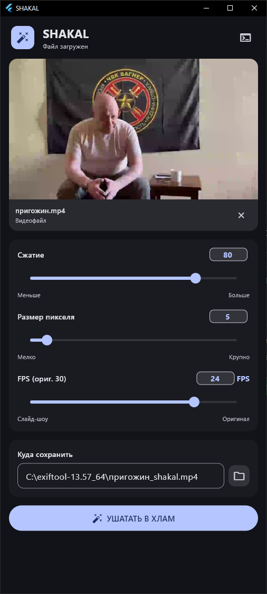

# SHAKAL

<sub><sup>очередной шедевр говно-вайбкодинга, при поддержке элитного (и не очень) ИИ-разработчика Gemini и DeepSeek</sup></sub>

Делает шакальные фото и видео. Сжимает контент в полнейшую кашу, убивая качество картинки и звука до уровня сони эриксон.



## Что он конкретно делает:

1. **Жёстко пикселизирует:** Сжимает разрешение медиафайла по алгоритму Box и растягивает обратно через Nearest Neighbor, создавая честный эффект гигантских пикселей.
2. **Душит видеобитрейт:** Экспоненциально режет битрейт видео в зависимости от ползунка сжатия (на максимальном «шакале» сжимает поток до ~55 kbps).
3. **Гробит звук:** Снижает частоту дискретизации аудио до телефонных 8000 Гц и сжимает аудиодорожку до экстремальных 8 kbps.
4. **Занижает FPS:** Срезает кадры в видео до слайд-шоу (хоть до 1 кадра в секунду).
5. **Вычищает метаданные:** Картинки на выходе полностью лишаются EXIF-тегов и любых следов оригинальной камеры.

---

## Фичи:

*   **Полная автономность:** Сборка весит ~41 МБ и запускается на любой Windows x64 из коробки, не требуя установки .NET или дополнительных библиотек.
*   **Умный загрузчик FFmpeg:** Если FFmpeg не найден — программа сама скачает свежую сборку из официального репозитория.
*   **Drag-and-Drop:** Возьми-и-Брось.
*   **Material Design 3:** Адаптивный интерфейс с динамической темой и акцентным цветом Windows.
*   **Логи:** Если что-то не работает, то поможет определить что именно и почему именно.

---

## Установка и запуск

### Вариант 1 — готовый билд

1. Перейдите в раздел **[Releases](https://github.com/lepex1/shakal/releases)**.
2. Скачайте архив `shakal-win-x64.zip`.
3. Распакуйте в любое место и запустите `shakal.exe`.

### Вариант 2 — сборка из исходников

```bash
git clone https://github.com/lepex1/shakal.git
cd shakal
flutter pub get
flutter build windows --debug
./build/windows/x64/runner/Debug/shakal.exe
```

### Вариант 3 — запуск через flutter run

```bash
git clone https://github.com/lepex1/shakal.git
cd shakal
flutter pub get
flutter run -d windows
```
